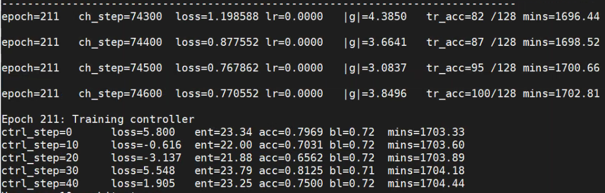

# ENAS in Tensorflow2.0

Tensorflow2.0 implementation of [Efficient Neural Architecture Search via Parameters Sharing](https://arxiv.org/abs/1802.03268).

**TF1\.\*  implementation (official code) can be  taken from the  [link](https://github.com/melodyguan/enas)**

## STILL DEVELOPING

- [x] macro search 
- [ ] micro search
- [ ] BN infer case
- [ ] low GPU-util(slow training)
- [ ] fixed_arc training
- [ ] aux_heads
- [ ] lr_cosine
- [ ] test data
- [ ] multi gpu
- [ ] save model weights

## Prerequisites

- python 3.5+
- tensorflow2.0
- matplotlib

## Usage

### macro

- run main_macro.py directly
- run ./scripts/cifar10_macro_search.sh

### micro

## Results

### macro

taking same metric as official version in macro search space

70% valid_acc after 100 epoch 

### micro

## Reference

- [Neural Architecture Search with Reinforcement Learning](https://arxiv.org/abs/1611.01578)
- [Neural Optimizer Search with Reinforcement Learning](https://arxiv.org/abs/1709.07417)
- [Efficient Neural Architecture Search via Parameter Sharing](https://arxiv.org/abs/1802.03268)