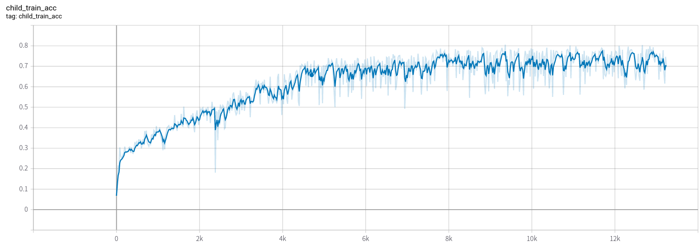
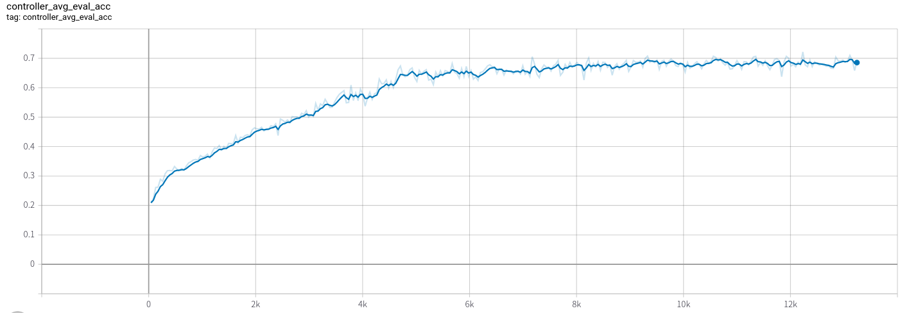

# ENAS in Tensorflow2.0

Tensorflow2.0 implementation of [Efficient Neural Architecture Search via Parameters Sharing](https://arxiv.org/abs/1802.03268).

**TF1\.\*  implementation (official code) can be  taken from the  [link](https://github.com/melodyguan/enas)**

## Results

### macro
#### search
whole searching phase(300 epochs) needs ~5 hours with 1024 batch-size on Titan RTX 24G
> if 256 batch-size, it needs ~10 hours

- 1024 batch-size result: 
    - train acc
      
    - eval acc
      
#### retrain

## STILL DEVELOPING

- [x] macro search 
- [ ] not search_whole_channels
- [x] low GPU-util while searching(solution:increase batch-size)
- [ ] micro search
- [ ] BN infer case
- [ ] fixed_arc training
- [ ] aux_heads
- [ ] lr_cosine
- [ ] test data
- [ ] multi gpu
- [ ] save model weights

## Prerequisites

- python 3.5+
- tensorflow2.0
- matplotlib

## Usage

### macro

- run main_macro.py directly

### micro

None

## Reference

- [Neural Architecture Search with Reinforcement Learning](https://arxiv.org/abs/1611.01578)
- [Neural Optimizer Search with Reinforcement Learning](https://arxiv.org/abs/1709.07417)
- [Efficient Neural Architecture Search via Parameter Sharing](https://arxiv.org/abs/1802.03268)